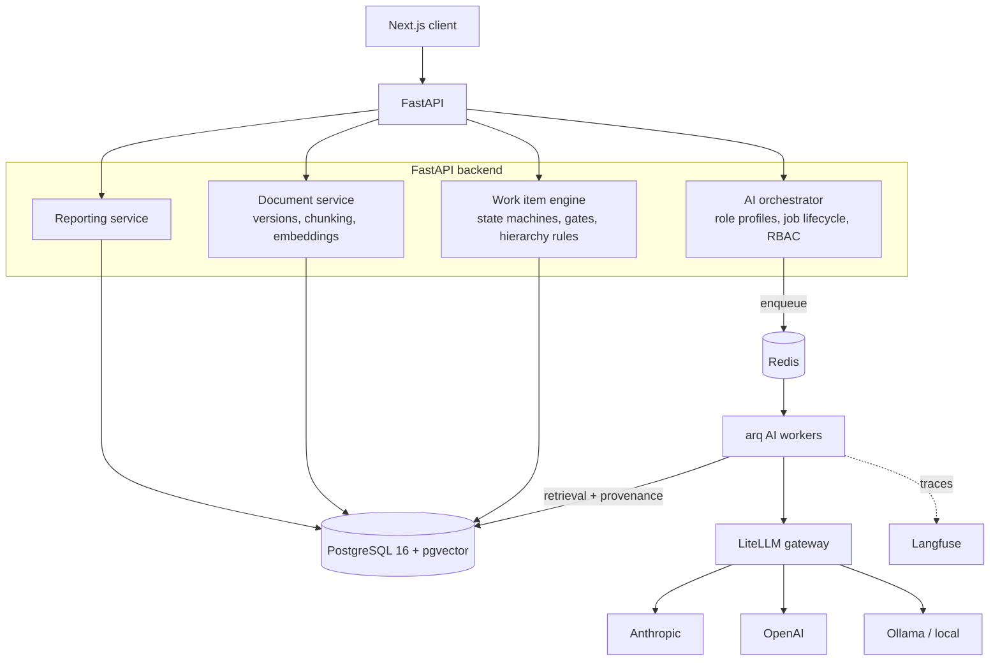
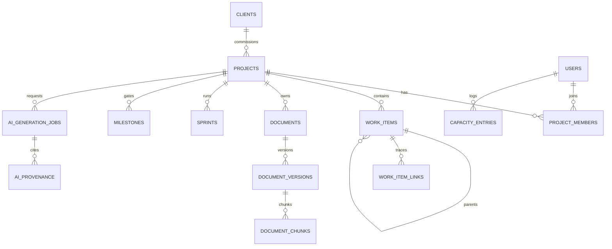

# Krititva AI — Full-Stack Application Blueprint (v0.2)

**Positioning:** An open-source, self-hostable project management platform for software agencies and services firms, supporting both Waterfall and Agile methodologies per project, with a contextual multi-agent AI layer that generates and maintains the full artifact chain — SRS → Epics → HLD/LLD → User Stories → Tasks → Test Cases — with end-to-end traceability.

**Decisions locked:** open-source project · dev agencies & services firms wedge · backend built from scratch (UI from mature OSS primitives) · fully local AI (Ollama-first, zero external calls) · SSE job streaming · Agile template ships v1, Waterfall v1.1 · Turborepo monorepo.

---

## 1. Product & Open-Source Strategy

### 1.1 Why the agency wedge shapes the design

Agencies run many concurrent client projects under different methodologies (a bank client demands stage gates and sign-offs; a startup client wants two-week sprints). Their commercial life revolves around the SRS-to-delivery chain: the SRS defines the contract scope, milestones map to invoices, and the traceability chain is their defense in scope disputes. This drives four design consequences that generic PM tools ignore:

1. A first-class `clients` entity above projects, with client-shareable roadmap-vs-milestone reports.
2. Methodology chosen **per project**, not per instance.
3. Multi-project resource allocation (one developer split across three client projects) as a core concept in the capacity model, even though full capacity planning ships post-v1.
4. BYO LLM keys and local-model support (Ollama) — agencies cannot send client SRS documents to a hardwired third-party vendor, and some client contracts forbid external AI processing entirely (per-project AI on/off switch).

### 1.2 License

**Recommendation: AGPL-3.0 for the core, with a DCO or lightweight CLA on contributions.**

- AGPL protects the project from cloud vendors re-hosting it as a closed service — the same reasoning behind Plane, Cal.com, and Grafana-adjacent projects.
- Agencies self-hosting internally are unaffected by AGPL obligations (they aren't distributing).
- A CLA/DCO preserves the option of a future dual-licensed cloud/enterprise edition (open-core) without relicensing pain.
- If maximum adoption matters more than protection, Apache-2.0 is the alternative; MIT gives away too much for a product-shaped project.

### 1.3 Open-source operational requirements (non-negotiable for v1)

- One-command deploy: `docker compose up` brings up web, API, worker, Postgres (with pgvector), and Redis.
- Provider-agnostic AI via a gateway layer; org-level encrypted key storage; Ollama endpoint support.
- Telemetry strictly opt-in; zero phone-home by default.
- Plugin surface for AI agents (Python entry points) so the community can contribute new role agents without forking core.

---

## 2. Scope

### 2.1 In scope for v1

| Area | v1 commitment |
|---|---|
| Work item engine | Single polymorphic model; Agile (Epic→Feature→Story→Task), Waterfall (Phase→Deliverable→Task), and Hybrid profiles; configurable state machines with hard gate enforcement |
| Documents | Versioned Markdown SRS/HLD/LLD/Test Plans; section-aware chunking + embeddings on save; Mermaid.js rendering |
| AI layer | Five role agents (PO, Architect, Scrum Master, Developer, QA) in **draft-and-review** mode only; full provenance recording |
| Teams | Client registry, project membership with roles, simple per-sprint available-hours |
| Tracking | Sprints, milestones/gates with approval workflow, one report: roadmap vs. milestone achievement |
| Platform | Docker Compose self-hosting, REST API, OpenAPI docs |

### 2.2 Explicitly out of scope for v1 (deferred, not rejected)

Full capacity planning (velocity modeling, vacation calendars, cross-project load balancing) → v1.5 once historical data exists. Critical path method math (forward/backward pass, float) → v1.5; v1 ships gate sequencing only. Autonomous AI actions (auto-assigning, auto-moving items) → post-v2, always opt-in. GitHub/GitLab/Slack integrations → v2 via webhook + plugin surface. Real-time collaborative editing (CRDTs) → v2; v1 uses optimistic locking + versioning. Native mobile apps, Gantt auto-scheduling, time tracking/billing → out entirely for now (billing integrates via API instead).

---

## 3. Technical Architecture

### 3.1 Stack

| Layer | Choice | Rationale |
|---|---|---|
| Frontend | Next.js 15 + TypeScript, TanStack Query, shadcn/ui, TipTap (Markdown editor), Mermaid.js, dnd-kit (boards), an OSS Gantt component | Assemble, don't build, UI primitives |
| API | Python 3.12, FastAPI, SQLAlchemy 2.0 async, Alembic, Pydantic v2 | Async-first; Pydantic doubles as LLM structured-output schemas |
| AI jobs | arq workers over Redis | Lightweight, asyncio-native; Celery only if the community needs its ecosystem |
| Data | PostgreSQL 16 + pgvector, Redis 7 | One database is the deployment story; pgvector removes the need for a separate vector store |
| LLM access | Ollama (default) behind an OpenAI-compatible gateway abstraction | Fully local by design; vLLM/LM Studio interchangeable; models pulled at first run, never bundled |
| AI observability | Langfuse (self-hosted, OSS) | Traces every generation; essential for debugging "the AI wrote a bad LLD" |
| Auth | OIDC-capable (Authlib) + local accounts; RBAC in-app | Agencies often need SSO against client or internal IdPs |

### 3.2 Component responsibilities



**Work item engine.** One `work_items` table for everything from a Waterfall phase deliverable to an Agile task. Methodology is a *profile* on the project that constrains (a) allowed item types and parent/child pairs, and (b) allowed state transitions — including hard gates, which are transitions requiring an approval record from a permitted role. Hybrid mode (Waterfall gates wrapping Agile sprints, common in agency-to-enterprise contracts) falls out of this design for free.

**Document service.** SRS/HLD/LLD are structured Markdown, versioned on every save. Each version is chunked by heading hierarchy (`section_path` like `3.2.1 Authentication`) and embedded. Only the *current approved* version participates in AI retrieval by default, which prevents the AI from citing stale requirements.

**AI orchestrator + workers.** The API layer validates, authorizes, and enqueues; workers assemble context, call the model through the gateway with a structured-output schema, and persist the result as a **draft** plus a provenance record. Nothing the AI produces becomes canonical until a human accepts it — this is both a trust feature and the mechanism that makes generations auditable for agency/client disputes.

---

## 4. Database Schema (PostgreSQL 16 + pgvector)

### 4.1 Entity overview



### 4.2 DDL

```sql
CREATE EXTENSION IF NOT EXISTS vector;
CREATE EXTENSION IF NOT EXISTS pgcrypto;

-- ---------- Enumerations ----------
CREATE TYPE methodology     AS ENUM ('agile', 'waterfall', 'hybrid');
CREATE TYPE project_role    AS ENUM ('project_owner', 'scrum_master', 'developer', 'qa', 'viewer');
CREATE TYPE work_item_kind  AS ENUM ('phase', 'epic', 'feature', 'story', 'task', 'bug', 'deliverable', 'test_case');
CREATE TYPE doc_type        AS ENUM ('srs', 'hld', 'lld', 'test_plan', 'other');
CREATE TYPE doc_status      AS ENUM ('draft', 'in_review', 'approved', 'superseded');
CREATE TYPE gate_status     AS ENUM ('pending', 'in_review', 'approved', 'rejected');
CREATE TYPE agent_role      AS ENUM ('project_owner', 'architect', 'scrum_master', 'developer', 'qa');
CREATE TYPE artifact_type   AS ENUM ('srs', 'epic_breakdown', 'hld', 'lld', 'sprint_plan',
                                     'story_breakdown', 'task_breakdown', 'api_contract',
                                     'test_plan', 'test_cases');
CREATE TYPE job_status      AS ENUM ('queued', 'running', 'awaiting_review', 'accepted', 'rejected', 'failed');
CREATE TYPE capacity_kind   AS ENUM ('availability', 'vacation', 'allocation');
CREATE TYPE link_type       AS ENUM ('derived_from', 'tests', 'blocks', 'relates_to');

-- ---------- Identity & tenancy ----------
CREATE TABLE users (
    id            UUID PRIMARY KEY DEFAULT gen_random_uuid(),
    email         CITEXT UNIQUE NOT NULL,
    display_name  TEXT NOT NULL,
    password_hash TEXT,                      -- NULL when SSO-only
    is_active     BOOLEAN NOT NULL DEFAULT TRUE,
    created_at    TIMESTAMPTZ NOT NULL DEFAULT now()
);

CREATE TABLE clients (                       -- the agency's customers
    id           UUID PRIMARY KEY DEFAULT gen_random_uuid(),
    name         TEXT NOT NULL,
    contact_json JSONB NOT NULL DEFAULT '{}',
    created_at   TIMESTAMPTZ NOT NULL DEFAULT now()
);

-- ---------- Projects & methodology ----------
CREATE TABLE projects (
    id            UUID PRIMARY KEY DEFAULT gen_random_uuid(),
    client_id     UUID REFERENCES clients(id),
    key           TEXT NOT NULL UNIQUE,      -- e.g. 'ACME-PORTAL'
    name          TEXT NOT NULL,
    methodology   methodology NOT NULL,
    ai_enabled    BOOLEAN NOT NULL DEFAULT TRUE,   -- contract-level AI kill switch
    llm_config    JSONB NOT NULL DEFAULT '{}',     -- provider/model overrides per project
    start_date    DATE,
    target_date   DATE,
    status        TEXT NOT NULL DEFAULT 'active',
    created_at    TIMESTAMPTZ NOT NULL DEFAULT now()
);

CREATE TABLE project_members (
    project_id     UUID NOT NULL REFERENCES projects(id) ON DELETE CASCADE,
    user_id        UUID NOT NULL REFERENCES users(id)    ON DELETE CASCADE,
    role           project_role NOT NULL,
    allocation_pct SMALLINT NOT NULL DEFAULT 100
                   CHECK (allocation_pct BETWEEN 0 AND 100),
    PRIMARY KEY (project_id, user_id)
);

-- ---------- Methodology configuration (data, not code) ----------
CREATE TABLE workflow_states (
    id          UUID PRIMARY KEY DEFAULT gen_random_uuid(),
    project_id  UUID NOT NULL REFERENCES projects(id) ON DELETE CASCADE,
    key         TEXT NOT NULL,               -- 'backlog', 'in_progress', 'qa', 'done', 'gate_review'
    label       TEXT NOT NULL,
    category    TEXT NOT NULL CHECK (category IN ('todo', 'in_progress', 'done')),
    sort_order  SMALLINT NOT NULL DEFAULT 0,
    UNIQUE (project_id, key)
);

CREATE TABLE workflow_transitions (
    id             UUID PRIMARY KEY DEFAULT gen_random_uuid(),
    project_id     UUID NOT NULL REFERENCES projects(id) ON DELETE CASCADE,
    from_state     UUID NOT NULL REFERENCES workflow_states(id) ON DELETE CASCADE,
    to_state       UUID NOT NULL REFERENCES workflow_states(id) ON DELETE CASCADE,
    is_hard_gate   BOOLEAN NOT NULL DEFAULT FALSE,   -- requires milestone approval
    required_role  project_role,                     -- who may execute it
    UNIQUE (project_id, from_state, to_state)
);

CREATE TABLE hierarchy_rules (               -- which kinds may parent which
    project_id  UUID NOT NULL REFERENCES projects(id) ON DELETE CASCADE,
    parent_kind work_item_kind NOT NULL,
    child_kind  work_item_kind NOT NULL,
    PRIMARY KEY (project_id, parent_kind, child_kind)
);
-- Seeded per methodology: agile => (epic,feature),(feature,story),(story,task)...
--                        waterfall => (phase,deliverable),(deliverable,task)...

-- ---------- Work items ----------
CREATE TABLE sprints (
    id         UUID PRIMARY KEY DEFAULT gen_random_uuid(),
    project_id UUID NOT NULL REFERENCES projects(id) ON DELETE CASCADE,
    name       TEXT NOT NULL,
    goal       TEXT,
    starts_on  DATE NOT NULL,
    ends_on    DATE NOT NULL,
    state      TEXT NOT NULL DEFAULT 'planned' CHECK (state IN ('planned','active','closed')),
    CHECK (ends_on > starts_on)
);

CREATE TABLE milestones (                    -- Agile milestones AND Waterfall phase gates
    id           UUID PRIMARY KEY DEFAULT gen_random_uuid(),
    project_id   UUID NOT NULL REFERENCES projects(id) ON DELETE CASCADE,
    name         TEXT NOT NULL,
    phase_kind   work_item_kind,             -- set for waterfall gates ('phase')
    due_date     DATE,
    is_hard_gate BOOLEAN NOT NULL DEFAULT FALSE,
    gate_status  gate_status NOT NULL DEFAULT 'pending',
    approved_by  UUID REFERENCES users(id),
    approved_at  TIMESTAMPTZ,
    sort_order   SMALLINT NOT NULL DEFAULT 0
);

CREATE TABLE work_items (
    id            UUID PRIMARY KEY DEFAULT gen_random_uuid(),
    project_id    UUID NOT NULL REFERENCES projects(id) ON DELETE CASCADE,
    kind          work_item_kind NOT NULL,
    parent_id     UUID REFERENCES work_items(id) ON DELETE SET NULL,
    seq           INTEGER NOT NULL,          -- per-project human number: ACME-PORTAL-142
    title         TEXT NOT NULL,
    description_md TEXT NOT NULL DEFAULT '',
    acceptance_md  TEXT,                     -- acceptance criteria for stories
    state_id      UUID NOT NULL REFERENCES workflow_states(id),
    assignee_id   UUID REFERENCES users(id),
    sprint_id     UUID REFERENCES sprints(id),
    milestone_id  UUID REFERENCES milestones(id),
    story_points  NUMERIC(5,1),
    estimated_hours NUMERIC(7,2),
    actual_hours    NUMERIC(7,2),
    rank          TEXT,                      -- lexoranking for backlog ordering
    created_by    UUID NOT NULL REFERENCES users(id),
    ai_generated  BOOLEAN NOT NULL DEFAULT FALSE,
    source_job_id UUID,                      -- FK added after ai_generation_jobs exists
    created_at    TIMESTAMPTZ NOT NULL DEFAULT now(),
    updated_at    TIMESTAMPTZ NOT NULL DEFAULT now(),
    UNIQUE (project_id, seq)
);
CREATE INDEX idx_wi_project_state ON work_items (project_id, state_id);
CREATE INDEX idx_wi_parent        ON work_items (parent_id);
CREATE INDEX idx_wi_sprint        ON work_items (sprint_id);

CREATE TABLE work_item_links (               -- the traceability matrix
    id          UUID PRIMARY KEY DEFAULT gen_random_uuid(),
    from_item   UUID NOT NULL REFERENCES work_items(id) ON DELETE CASCADE,
    to_item     UUID REFERENCES work_items(id) ON DELETE CASCADE,
    to_chunk    UUID,                        -- may target an SRS section instead of an item
    link_type   link_type NOT NULL,
    CHECK (to_item IS NOT NULL OR to_chunk IS NOT NULL)
);

-- ---------- Documents ----------
CREATE TABLE documents (
    id                 UUID PRIMARY KEY DEFAULT gen_random_uuid(),
    project_id         UUID NOT NULL REFERENCES projects(id) ON DELETE CASCADE,
    doc_type           doc_type NOT NULL,
    title              TEXT NOT NULL,
    current_version_id UUID,                 -- FK added below
    created_at         TIMESTAMPTZ NOT NULL DEFAULT now()
);

CREATE TABLE document_versions (
    id             UUID PRIMARY KEY DEFAULT gen_random_uuid(),
    document_id    UUID NOT NULL REFERENCES documents(id) ON DELETE CASCADE,
    version_no     INTEGER NOT NULL,
    content_md     TEXT NOT NULL,
    status         doc_status NOT NULL DEFAULT 'draft',
    change_summary TEXT,
    created_by     UUID NOT NULL REFERENCES users(id),
    ai_job_id      UUID,                     -- set when AI-drafted
    created_at     TIMESTAMPTZ NOT NULL DEFAULT now(),
    UNIQUE (document_id, version_no)
);
ALTER TABLE documents
    ADD CONSTRAINT fk_current_version
    FOREIGN KEY (current_version_id) REFERENCES document_versions(id);

CREATE TABLE document_chunks (
    id           UUID PRIMARY KEY DEFAULT gen_random_uuid(),
    version_id   UUID NOT NULL REFERENCES document_versions(id) ON DELETE CASCADE,
    section_path TEXT NOT NULL,              -- '3.2.1 Authentication'
    content      TEXT NOT NULL,
    token_count  INTEGER NOT NULL,
    embedding    vector(768)                 -- nomic-embed-text v1.5 (local, Apache-2.0)
);
CREATE INDEX idx_chunks_embedding ON document_chunks
    USING hnsw (embedding vector_cosine_ops);

-- ---------- Capacity ----------
CREATE TABLE capacity_entries (
    id          UUID PRIMARY KEY DEFAULT gen_random_uuid(),
    user_id     UUID NOT NULL REFERENCES users(id) ON DELETE CASCADE,
    project_id  UUID REFERENCES projects(id) ON DELETE CASCADE,  -- NULL => global (vacation)
    sprint_id   UUID REFERENCES sprints(id),
    kind        capacity_kind NOT NULL,
    starts_on   DATE NOT NULL,
    ends_on     DATE NOT NULL,
    hours       NUMERIC(6,2),
    CHECK (ends_on >= starts_on)
);
CREATE INDEX idx_capacity_user_range ON capacity_entries (user_id, starts_on, ends_on);

-- ---------- AI jobs & provenance ----------
CREATE TABLE ai_generation_jobs (
    id              UUID PRIMARY KEY DEFAULT gen_random_uuid(),
    project_id      UUID NOT NULL REFERENCES projects(id) ON DELETE CASCADE,
    requested_by    UUID NOT NULL REFERENCES users(id),
    agent_role      agent_role NOT NULL,
    target_artifact artifact_type NOT NULL,
    focus_item_id   UUID REFERENCES work_items(id),   -- e.g. the Epic being broken down
    instructions    TEXT,                             -- optional user steering
    status          job_status NOT NULL DEFAULT 'queued',
    model_used      TEXT,
    prompt_tokens   INTEGER,
    output_tokens   INTEGER,
    result_document_version UUID REFERENCES document_versions(id),
    error           TEXT,
    trace_id        TEXT,                             -- Langfuse trace
    created_at      TIMESTAMPTZ NOT NULL DEFAULT now(),
    finished_at     TIMESTAMPTZ
);

ALTER TABLE work_items ADD CONSTRAINT fk_wi_source_job
    FOREIGN KEY (source_job_id) REFERENCES ai_generation_jobs(id);

CREATE TABLE ai_provenance (                 -- exactly what the model was shown
    id            UUID PRIMARY KEY DEFAULT gen_random_uuid(),
    job_id        UUID NOT NULL REFERENCES ai_generation_jobs(id) ON DELETE CASCADE,
    source_chunk  UUID REFERENCES document_chunks(id),
    source_item   UUID REFERENCES work_items(id),
    similarity    REAL,
    CHECK (source_chunk IS NOT NULL OR source_item IS NOT NULL)
);
CREATE INDEX idx_provenance_job ON ai_provenance (job_id);

CREATE TABLE audit_log (
    id         BIGSERIAL PRIMARY KEY,
    project_id UUID,
    actor_id   UUID,
    action     TEXT NOT NULL,                -- 'gate.approved', 'ai.draft_accepted', ...
    entity     TEXT NOT NULL,
    entity_id  UUID,
    detail     JSONB NOT NULL DEFAULT '{}',
    created_at TIMESTAMPTZ NOT NULL DEFAULT now()
);
```

### 4.3 Schema design notes

**One work-item table, methodology as data.** `hierarchy_rules` and `workflow_transitions` are seeded from methodology templates when a project is created, then remain editable per project. Waterfall's "hard milestone gates" are simply transitions with `is_hard_gate = TRUE`: the engine refuses the transition unless the linked milestone's `gate_status = 'approved'`, and every approval lands in `audit_log` — which is precisely the sign-off trail an agency shows its client.

**Traceability is relational.** `work_item_links` with `link_type = 'derived_from'` pointing at either another item or an SRS `document_chunk` gives you the full requirements-traceability matrix as a recursive CTE — no graph database required. The same edges double as the AI's lineage retrieval path.

**Provenance is the trust layer.** Every AI generation records the exact chunks and items it consumed. "Why did the AI write this test case?" is answered with a SQL join, and regeneration after an SRS change can diff against prior provenance to show what moved.

---

## 5. AI Orchestration Strategy

### 5.1 The core idea: role agents = profile, not personality

Each "agent" is a **role profile**: a retrieval policy + a system prompt template + a structured output schema + a model tier. The QA agent isn't a different intelligence than the Architect — it's the same LLM shown different context and constrained to a different output shape. This framing keeps the system debuggable and lets community plugins add new agents by contributing a profile, not a framework.

| Agent | Produces | Retrieval policy (what context gets assembled) | Output schema | Model tier |
|---|---|---|---|---|
| Project Owner | SRS drafts, Epic breakdowns | Project brief, client notes, prior SRS versions | `SRSDocument`, `EpicBreakdown` | Frontier |
| System Architect | HLD, LLD (+ Mermaid) | Approved SRS (full or top-k chunks), existing HLD, tech-stack constraints | `DesignDocument` (sections + `mermaid_diagrams[]`) | Frontier |
| Scrum Master | Sprint goals, Story breakdowns, capacity flags | Target Epic + its `derived_from` SRS chunks, team velocity + `capacity_entries` | `StoryBreakdown`, `SprintPlan` | Mid |
| Developer | Task breakdowns, API contracts | Target Story + parent Epic + relevant LLD sections | `TaskBreakdown`, `APIContract` (OpenAPI fragment) | Mid |
| QA Engineer | Test plans, test cases, edge cases | Story acceptance criteria + traced SRS chunks + LLD interface sections | `TestPlan`, `TestCaseSet` | Mid (high volume) |

### 5.2 How the AI "remembers" the SRS: deliberate context assembly, not chat memory

There is no long-lived agent memory. Every generation is stateless and reproducible; "memory" is the database. The **Context Assembler** builds the prompt from three sources, in priority order, packed into a token budget:

1. **Lineage (graph traversal, always included).** A recursive CTE walks `work_item_links` from the focus item upward: Test Case ← Story ← Epic ← SRS section. These chunks are included verbatim — this is why the QA agent's test cases cite the exact SRS requirement they verify. Deterministic, not similarity-based.
2. **Semantic neighborhood (pgvector, fills remaining budget).** Top-k chunks from the *current approved versions* of the doc types the profile requires, ranked by cosine similarity to the focus item's title + description:

```sql
SELECT c.id, c.section_path, c.content,
       1 - (c.embedding <=> :query_vec) AS similarity
FROM document_chunks c
JOIN document_versions v ON v.id = c.version_id
JOIN documents d ON d.current_version_id = v.id      -- approved current only
WHERE d.project_id = :project_id
  AND d.doc_type = ANY(:doc_types)
ORDER BY c.embedding <=> :query_vec
LIMIT :k;
```

3. **Operational state (SQL, profile-dependent).** Sprint dates, team members and available hours, open items in the epic — serialized as compact JSON for profiles that need it (Scrum Master, Developer).

Everything included is written to `ai_provenance` before the LLM call, so the audit exists even if generation fails.

### 5.3 System prompt template (Architect → LLD example)

```text
You are the System Architect agent for project {project_key} ({methodology} methodology).
Generate a Low-Level Design in Markdown for the scope below.

Hard rules:
- Every design section MUST reference the SRS requirement IDs it satisfies
  using the form [SRS §{section_path}].
- Include Mermaid.js diagrams (```mermaid blocks) for component and sequence views.
- Do not invent requirements absent from the provided SRS context. If context
  is insufficient for a section, emit an OPEN QUESTION block instead of guessing.
- Respond only with JSON conforming to the DesignDocument schema.

<approved_hld>{hld_excerpt}</approved_hld>
<srs_context>{lineage_chunks + semantic_chunks, each tagged with section_path}</srs_context>
<constraints>{project.llm_config.tech_constraints}</constraints>
```

The "don't invent, emit OPEN QUESTION" instruction plus mandatory `[SRS §x.y]` citations is what turns generation into *traceable* generation — the UI renders those citations as links back to the SRS section.

### 5.4 Where LangGraph earns its keep (and where it doesn't)

Single-shot generations (LLD from SRS, test cases from a story) are **plain function calls**: assemble → call → validate → persist. No framework needed; frameworks here only obscure stack traces.

Multi-step workflows use **LangGraph** graphs with explicit state:

- *Epic decomposition*: `plan_stories → generate_each_story (fan-out) → validate_acceptance_criteria → capacity_check → human_review`. The validation node re-prompts on schema or citation failures (max 2 retries) before surfacing a partial result.
- *SRS ingestion*: `parse_sections → extract_requirements → detect_conflicts_with_existing_items → propose_epic_mapping`.
- *Regeneration on change*: when an SRS version is approved, a graph diffs chunks against the prior version, finds downstream artifacts via provenance, and queues "stale artifact" review flags — it does **not** silently regenerate.

Structured outputs use Pydantic models passed as the response schema through LiteLLM (`response_format` / tool-call enforcement depending on provider), so worker code never parses freeform text.

### 5.5 Model routing, cost, and privacy

Routing lives in the gateway config: frontier model for Architect/PO profiles, cheaper model for high-volume breakdown work, org- or project-level overrides in `projects.llm_config` (an agency can pin a client's project to their Ollama instance). Per-org budgets and rate limits are enforced at the LiteLLM layer. Prompt-injection posture: document content is data, wrapped in delimited blocks, with the system template instructing the model to ignore instructions inside them — and since output is schema-constrained and human-reviewed, injected instructions can't silently mutate project state.

---

## 6. FastAPI Boilerplate — `generate_project_artifact`

Async job pattern: the endpoint validates and enqueues (202), the worker does retrieval + generation, and the client polls or subscribes via SSE.

```python
# app/schemas/artifacts.py
from enum import Enum
from uuid import UUID
from pydantic import BaseModel, Field

class AgentRole(str, Enum):
    project_owner = "project_owner"
    architect = "architect"
    scrum_master = "scrum_master"
    developer = "developer"
    qa = "qa"

class ArtifactType(str, Enum):
    srs = "srs"; epic_breakdown = "epic_breakdown"
    hld = "hld"; lld = "lld"
    sprint_plan = "sprint_plan"; story_breakdown = "story_breakdown"
    task_breakdown = "task_breakdown"; api_contract = "api_contract"
    test_plan = "test_plan"; test_cases = "test_cases"

# Which agent may produce which artifact
ROLE_ARTIFACTS: dict[AgentRole, set[ArtifactType]] = {
    AgentRole.project_owner: {ArtifactType.srs, ArtifactType.epic_breakdown},
    AgentRole.architect:     {ArtifactType.hld, ArtifactType.lld},
    AgentRole.scrum_master:  {ArtifactType.sprint_plan, ArtifactType.story_breakdown},
    AgentRole.developer:     {ArtifactType.task_breakdown, ArtifactType.api_contract},
    AgentRole.qa:            {ArtifactType.test_plan, ArtifactType.test_cases},
}

# Upstream artifacts that must exist and be approved first
ARTIFACT_PREREQS: dict[ArtifactType, set[str]] = {
    ArtifactType.hld:        {"srs"},
    ArtifactType.lld:        {"srs", "hld"},
    ArtifactType.test_plan:  {"srs"},
    ArtifactType.test_cases: {"srs"},
}

class GenerateArtifactRequest(BaseModel):
    agent_role: AgentRole
    target_artifact: ArtifactType
    focus_item_id: UUID | None = None      # e.g. the Epic to break down
    instructions: str | None = Field(None, max_length=4000)

class GenerateArtifactResponse(BaseModel):
    job_id: UUID
    status: str = "queued"
```

```python
# app/api/routes/artifacts.py
from uuid import UUID
from fastapi import APIRouter, Depends, HTTPException, status
from sqlalchemy.ext.asyncio import AsyncSession

from app.api.deps import get_db, get_current_user, get_arq_pool
from app.models import AIGenerationJob, Project
from app.schemas.artifacts import (
    GenerateArtifactRequest, GenerateArtifactResponse,
    ROLE_ARTIFACTS, ARTIFACT_PREREQS,
)
from app.services import projects as project_svc
from app.services import documents as doc_svc

router = APIRouter(prefix="/projects/{project_id}/artifacts", tags=["ai"])

@router.post("", response_model=GenerateArtifactResponse,
             status_code=status.HTTP_202_ACCEPTED)
async def generate_project_artifact(
    project_id: UUID,
    body: GenerateArtifactRequest,
    db: AsyncSession = Depends(get_db),
    user=Depends(get_current_user),
    arq=Depends(get_arq_pool),
):
    project: Project = await project_svc.get_for_member(db, project_id, user.id)
    if project is None:
        raise HTTPException(404, "Project not found")          # opaque: no membership leak
    if not project.ai_enabled:
        raise HTTPException(403, "AI features are disabled for this project")

    if body.target_artifact not in ROLE_ARTIFACTS[body.agent_role]:
        raise HTTPException(422,
            f"{body.agent_role.value} agent cannot produce {body.target_artifact.value}")

    membership = await project_svc.get_membership(db, project_id, user.id)
    if not project_svc.may_invoke_agent(membership.role, body.agent_role):
        raise HTTPException(403, "Your project role cannot invoke this agent")

    missing = await doc_svc.missing_approved_docs(
        db, project_id, ARTIFACT_PREREQS.get(body.target_artifact, set()))
    if missing:
        raise HTTPException(409,
            f"Approved prerequisite document(s) missing: {', '.join(sorted(missing))}")

    job = AIGenerationJob(
        project_id=project_id, requested_by=user.id,
        agent_role=body.agent_role.value,
        target_artifact=body.target_artifact.value,
        focus_item_id=body.focus_item_id,
        instructions=body.instructions,
    )
    db.add(job)
    await db.commit()

    await arq.enqueue_job("run_artifact_generation", str(job.id))
    return GenerateArtifactResponse(job_id=job.id)


@router.get("/jobs/{job_id}")
async def get_job(project_id: UUID, job_id: UUID,
                  db: AsyncSession = Depends(get_db),
                  user=Depends(get_current_user)):
    job = await project_svc.get_job_for_member(db, project_id, job_id, user.id)
    if job is None:
        raise HTTPException(404, "Job not found")
    return {"job_id": job.id, "status": job.status,
            "result_document_version": job.result_document_version,
            "error": job.error}
```

```python
# app/workers/generation.py  (arq worker)
import litellm
from app.db import session_scope
from app.ai.profiles import ROLE_PROFILES           # retrieval policy + template + schema
from app.ai.context import ContextAssembler
from app.models import AIGenerationJob

async def run_artifact_generation(ctx, job_id: str):
    async with session_scope() as db:
        job = await db.get(AIGenerationJob, job_id)
        job.status = "running"
        await db.commit()

        profile = ROLE_PROFILES[(job.agent_role, job.target_artifact)]
        try:
            assembled = await ContextAssembler(db).assemble(
                project_id=job.project_id,
                profile=profile,
                focus_item_id=job.focus_item_id,
            )
            await assembled.persist_provenance(db, job.id)   # audit BEFORE the call

            response = await litellm.acompletion(
                model=await profile.resolve_model(db, job.project_id),  # org/project routing
                messages=[
                    {"role": "system", "content": profile.render_system(assembled)},
                    {"role": "user", "content": profile.render_task(assembled, job.instructions)},
                ],
                response_format=profile.output_schema,        # Pydantic-enforced JSON
                metadata={"trace_id": str(job.id)},           # Langfuse correlation
            )
            artifact = profile.output_schema.model_validate_json(
                response.choices[0].message.content)

            version = await profile.persist_draft(db, job, artifact)   # draft, not canonical
            job.status = "awaiting_review"
            job.result_document_version = version.id
            job.model_used = response.model
            job.prompt_tokens = response.usage.prompt_tokens
            job.output_tokens = response.usage.completion_tokens
        except Exception as exc:                              # noqa: BLE001
            job.status = "failed"
            job.error = str(exc)[:2000]
        finally:
            job.finished_at = func_now()
            await db.commit()
```

The `ContextAssembler` implements §5.2: lineage CTE first, pgvector fill second, operational state third, packed to the profile's token budget with per-chunk `section_path` tags. `persist_draft` writes a `document_versions` row with `status='draft'` (or draft `work_items` with `ai_generated=TRUE`) — acceptance is a separate, human, audited endpoint.

---

## 7. Repository Layout & Deployment

```
krititva/
├── apps/web/                  # Next.js
├── apps/api/
│   └── app/
│       ├── api/routes/        # projects, work_items, documents, artifacts, reports
│       ├── models/            # SQLAlchemy
│       ├── schemas/           # Pydantic (API + LLM output schemas)
│       ├── services/          # work item engine, gates, capacity, reports
│       ├── ai/
│       │   ├── profiles/      # one module per agent role (plugin entry points)
│       │   ├── context.py     # ContextAssembler
│       │   └── graphs/        # LangGraph multi-step workflows
│       └── workers/           # arq tasks
├── packages/methodology-templates/   # seed JSON: agile / waterfall / hybrid
├── deploy/docker-compose.yml         # web, api, worker, postgres+pgvector, redis, litellm, langfuse
└── docs/                             # + CONTRIBUTING, agent plugin guide
```

## 8. Roadmap

| Milestone | Contents |
|---|---|
| **M0 — Foundation** (weeks 1–4) | Auth/RBAC, projects/clients, work item engine + methodology templates, docker-compose |
| **M1 — Artifact chain MVP** (5–10) | Document service + versioning + embeddings, Architect & QA agents end-to-end with provenance, draft/review UI |
| **M2 — Full agent suite** (11–16) | PO, Scrum Master, Developer agents; LangGraph decomposition flows; stale-artifact flags; gates + audit trail complete |
| **M3 — Agency layer** (17–20) | Roadmap-vs-milestone report (client-shareable), simple capacity + bottleneck flags, Langfuse dashboards |
| **M4 — Community launch** | Docs, agent plugin SDK, demo instance, AGPL release, Show HN |

## 9. Decision Record (v0.2)

| # | Decision | Consequence |
|---|---|---|
| 1 | **Fully local AI.** Default embedding model `nomic-embed-text` v1.5 (Apache-2.0, CPU-friendly, 768 dims → `vector(768)`); generation via Ollama | Zero-external-calls guarantee becomes a headline feature for the agency wedge. Model tiers by hardware: ~8B class (Qwen/Llama family) for breakdown agents on 8 GB VRAM; ~30B class for the Architect tier on 24 GB. Architect workflows generate designs **section-by-section** with validation/retry, since small local models degrade on whole-document scopes. Keep the OpenAI-compatible gateway layer so any local server (Ollama, vLLM, LM Studio) plugs in; orgs that later want cloud models can point the same config at a hosted endpoint. Never redistribute weights (license incompatibility with AGPL repo) — pull on first run. Ollama's JSON-schema `format` parameter enforces structured outputs. |
| 2 | **SSE for job streaming.** `GET /projects/{id}/artifacts/jobs/{job_id}/events` | Worker publishes progress to a per-job Redis pub/sub channel; API bridges to SSE. Reference nginx config disables proxy buffering (`X-Accel-Buffering: no`). Falls back to polling the job endpoint. |
| 3 | **Agile template ships in v1; Waterfall in v1.1.** | The gate/milestone engine, `hierarchy_rules`, and `is_hard_gate` transitions still ship in v1 core — Waterfall then arrives as a seed JSON file plus Gantt view, not new engine code. Keeps the agency positioning intact on a v1.1 timeline. |
| 4 | **Turborepo monorepo.** | `apps/web`, `apps/api`, `packages/methodology-templates`, `packages/api-client` (generated from OpenAPI). Remote caching optional for contributors. |
