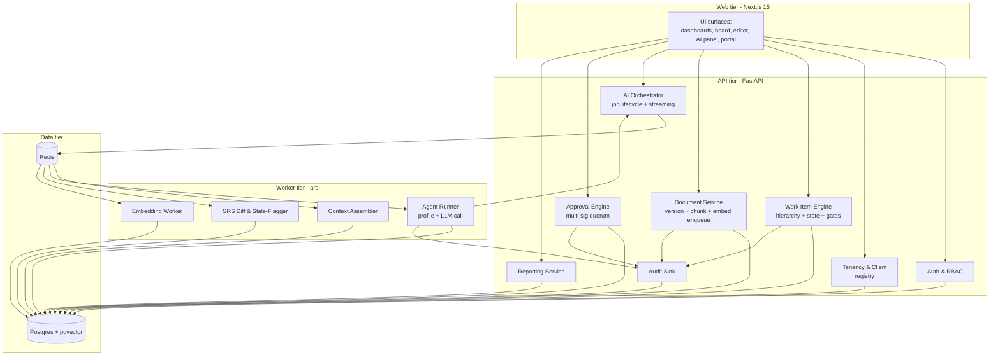
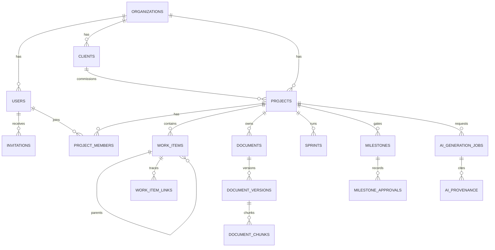
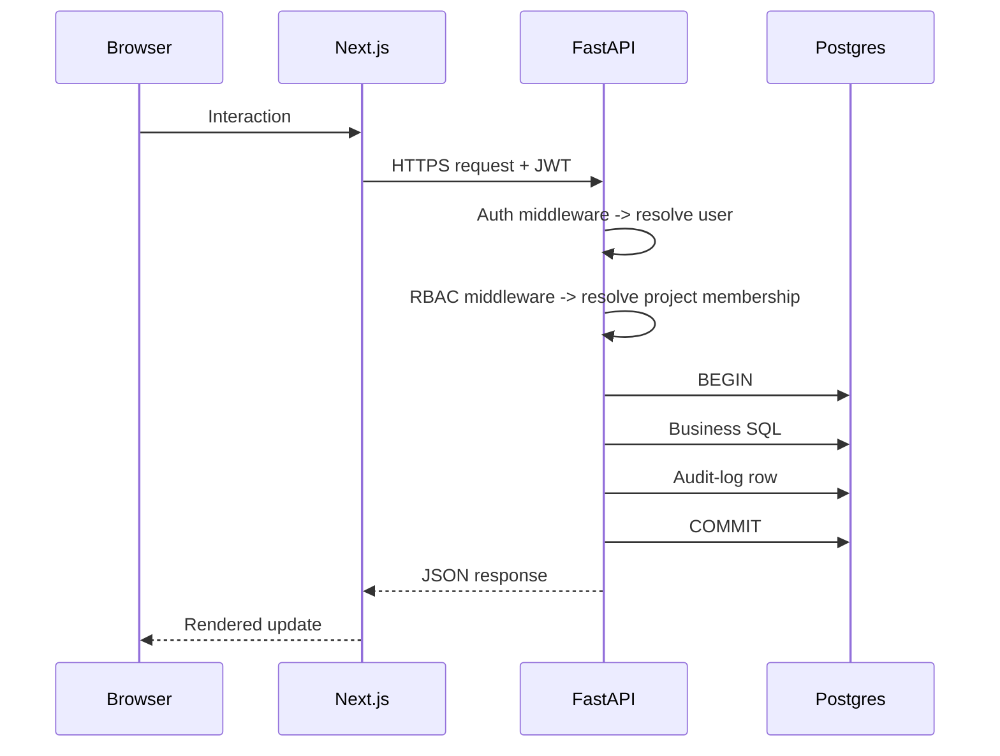
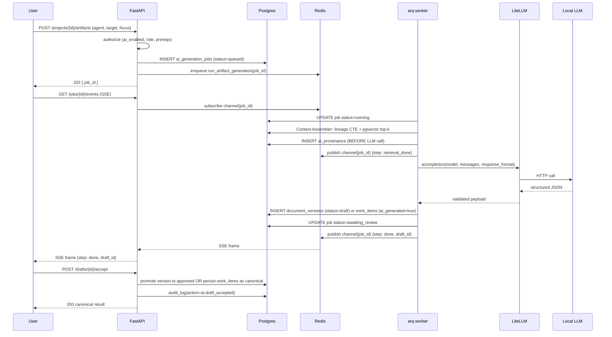
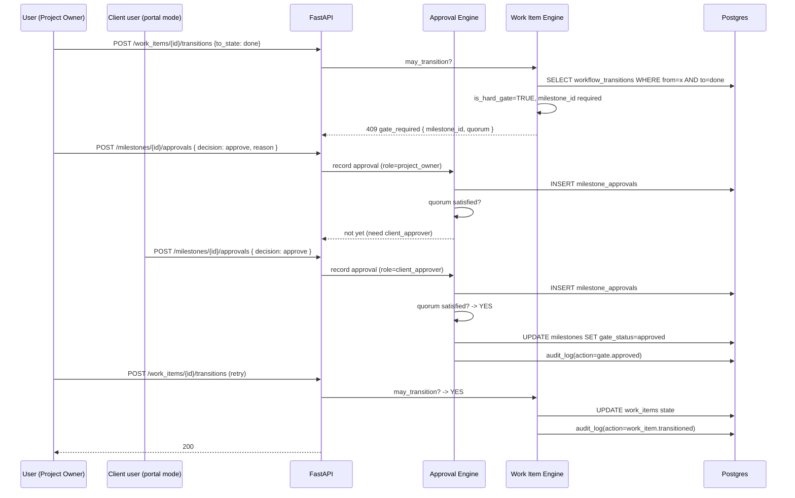
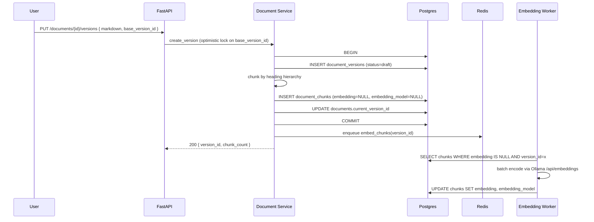
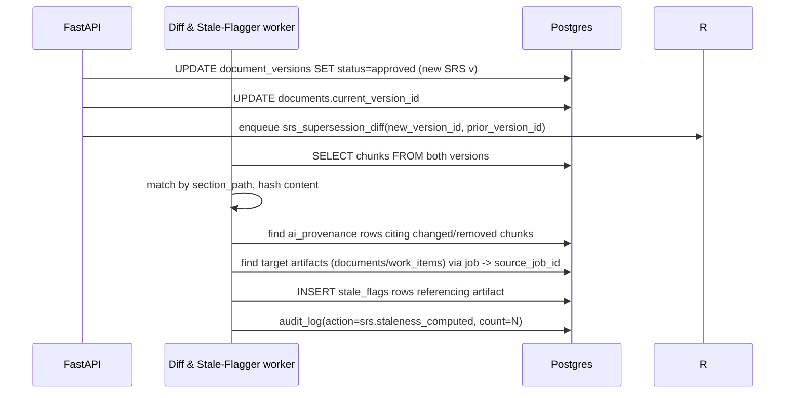
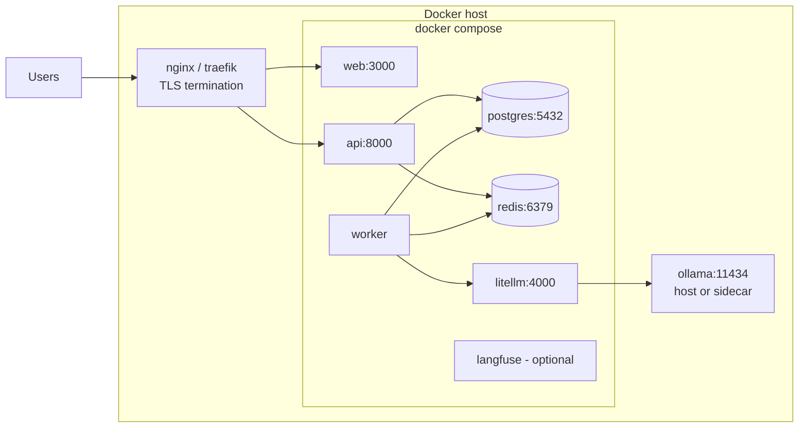

# Krititva AI — High-Level Design (v1.0)

**Status:** Draft for review
**Upstream:** [krititva-srs.md](krititva-srs.md), [krititva-ai-blueprint.md](krititva-ai-blueprint.md)
**Downstream:** [krititva-lld.md](krititva-lld.md), [krititva-roadmap.md](krititva-roadmap.md)

This document specifies the architecture of Krititva AI at the module, boundary, and sequence level. It does not fix implementation details (types, function signatures, exact SQL) — those live in the LLD. Every architectural choice below is either directly traced to an SRS requirement or is a supporting decision required to satisfy multiple requirements.

---

## 1. Architectural Goals & Constraints

### 1.1 Goals derived from the SRS
1. **Provable traceability**: every artifact must be reachable from its source SRS chunk in a single relational query (§FR-4.6.9, §OR-6.3.1).
2. **Draft-and-review as the only path to canonical**: no autonomous AI mutation of project state (§FR-4.6.5, §FR-4.6.6).
3. **Fully local operation**: zero external calls in the default install (§NFR-5.5.2, §FR-4.12.5).
4. **One-command self-host**: `docker compose up` brings up a functional stack (§FR-4.12.1).
5. **Methodology as data**: Agile, Waterfall, and Hybrid share one engine (§FR-4.3.*).
6. **Immutability at the audit boundary**: document versions, AI jobs, and audit log rows are append-only (§FR-4.10.4).

### 1.2 Explicit non-goals for v1
- Horizontal write scaling across Postgres replicas (single primary is fine at the target scale).
- Autonomous AI actions (opt-in, post-v2).
- CRDT collaborative editing.
- Real-time WebSocket surface (SSE covers v1 needs).

### 1.3 Cross-cutting constraints
- Python 3.12 backend, TypeScript/Next.js 15 frontend (§SRS 2.5).
- One database (Postgres 16 + pgvector). No separate vector store.
- Redis is the only additional runtime dependency.
- AGPL-3.0 core; no bundled LLM weights.

---

## 2. System Context

```mermaid
flowchart LR
    subgraph Users
        AGENCY[Agency staff\n(PO, SM, Dev, QA, Viewer)]
        CLIENT[Client stakeholders\n(external, optional)]
        ADMIN[Org admin]
    end

    subgraph Krititva[Krititva AI self-hosted stack]
        WEB[Next.js web]
        API[FastAPI]
        WORKER[arq AI workers]
        DB[(Postgres 16 + pgvector)]
        R[(Redis 7)]
        GW[LiteLLM gateway]
        LF[Langfuse - optional]
    end

    subgraph External[External - all optional]
        IDP[OIDC IdP]
        OLL[Local LLM\n(Ollama / vLLM / LM Studio)]
        HOSTED[Hosted LLM\n(Anthropic / OpenAI)]
        SMTP[SMTP]
    end

    AGENCY & CLIENT & ADMIN --> WEB
    WEB --> API
    API --> DB
    API --> R
    R --> WORKER
    WORKER --> DB
    WORKER --> GW
    GW --> OLL
    GW -.-> HOSTED
    API -.-> IDP
    API -.-> SMTP
    WORKER -.-> LF
```

Solid arrows = required. Dashed arrows = opt-in. The default install has no dashed arrow active.

---

## 3. Logical Architecture

The system is organized into eight modules with strict responsibility boundaries.



### 3.1 Module responsibilities

| Module | Owns | Does NOT own |
|---|---|---|
| **Auth & RBAC** | User accounts, sessions, JWTs, invitations, SSO integration, role assignment, project membership | Business rules; only checks "may X perform Y on Z" |
| **Tenancy & Client registry** | Organizations, clients, projects, `llm_config`, `client_portal_mode` | Work items or documents themselves |
| **Work Item Engine** | `work_items`, `work_item_links`, `workflow_states`, `workflow_transitions`, `hierarchy_rules`, `sprints`, `milestones` (the object), lexorank operations, cycle detection | Approvals (delegates to Approval Engine) |
| **Document Service** | `documents`, `document_versions`, `document_chunks`, chunking, embedding enqueue, optimistic locking, export | Rendering (client-side) |
| **AI Orchestrator** | `ai_generation_jobs`, `ai_provenance`, enqueue, SSE bridging, per-user concurrency limits, kill-switch enforcement | Prompt construction (delegates to Agent Runner via profile) |
| **Approval Engine** | `milestone_approvals`, quorum evaluation, revocation semantics, gate-transition authorization | Executing the transition itself (returns "may transition" to Work Item Engine) |
| **Reporting Service** | Roadmap-vs-milestone view, team progress view, PDF export, signed link generation | Business events (reads from other modules) |
| **Audit Sink** | Append-only `audit_log` writes, JSONL export | Business decisions |

### 3.2 Boundary rules
- API-tier modules SHALL communicate via typed service classes, not by sharing SQLAlchemy sessions across module boundaries within a single request. One request → one session → many services.
- Worker-tier modules SHALL open their own sessions per job. Session state SHALL NOT be shared across jobs.
- Cross-module writes SHALL be composed in the calling handler, not by one service reaching into another's table. Exception: `Audit Sink` is called by every module.

---

## 4. Data Architecture (high-level)

Full DDL lives in the [LLD §2](krititva-lld.md); this section fixes the *shape* only.

### 4.1 Tenancy layering
Every tenant-scoped table carries a nullable `organization_id UUID`. In v1 self-host, exactly one row exists in `organizations`; the column is populated on write but is not enforced non-null at the DB level to keep migration paths reversible. When multi-tenancy is enabled in a future release, a single migration backfills the column and adds the `NOT NULL` constraint plus per-org indexes.

### 4.2 Core entity groups



### 4.3 Embedding storage
- `document_chunks.embedding vector(768)` + `embedding_model TEXT` (primary, default `nomic-embed-text-v1.5`).
- `document_chunks.embedding_alt vector(1536)` + `embedding_alt_model TEXT` (optional, for organizations using a second tier).
- HNSW indexes on both vector columns (partial-index-friendly to `WHERE embedding_alt IS NOT NULL`).
- Retrieval selects the column matching the configured retrieval model in `project.llm_config.retrieval_model`.

### 4.4 Immutability contract
- `document_versions`: rows are append-only. Status transitions on the row itself are allowed (`draft → in_review → approved → superseded`) but content and chunk fingerprints do not mutate.
- `ai_generation_jobs`: append-only after `finished_at`. Post-review acceptance writes a separate `document_versions` or `work_items` row and links via `source_job_id`.
- `ai_provenance`, `audit_log`, `milestone_approvals`: strictly append-only.

### 4.5 Storage for uploaded assets
- Local filesystem volume (`/var/lib/krititva/assets`) is the default. S3-compatible object stores are pluggable via a storage backend interface but out of scope for v1 default install.

---

## 5. Runtime Architecture

### 5.1 Request lifecycle for a synchronous API call



### 5.2 AI generation lifecycle



Key invariants:
- **Provenance is written before the LLM call.** Even if the model call fails or hangs, the audit trail exists.
- **Draft persistence is atomic with job status update.** A worker that finishes generation but crashes before the status update leaves a durable draft that a resume sweeper can promote to `awaiting_review`.
- **SSE is a *bridge*, not the source of truth.** Reconnecting clients poll `GET /jobs/{id}` and see the same state.

### 5.3 Hard-gate transition



### 5.4 Document save + chunk + embed



Embedding is asynchronous by design: save latency stays within §NFR-5.1.5, and the retrieval side (§FR-4.5.6) only consults *approved* versions, which by policy are approved *after* embeddings complete.

### 5.5 SRS supersession → stale flags



The system does not auto-regenerate. Stale flags surface in the AI panel; humans re-invoke agents.

---

## 6. AI Subsystem Architecture

### 6.1 Role agent as data

Each of the five v1 agents (§FR-4.6.1) is a Python module in `apps/api/app/ai/profiles/` registered via the `krititva.agents` entry-point group. A profile exposes:

- `retrieval_policy(project, focus_item)` → the recipe for context assembly (which doc types to search, whether to include operational state, token budget).
- `system_template` and `user_template` → Jinja templates rendered against assembled context.
- `output_schema` → a Pydantic model passed as `response_format` to LiteLLM.
- `model_tier` → `frontier | mid | fast`, resolved by `LLMConfigResolver` into a concrete model name.
- `persist_draft(job, artifact) → version_id | work_items` → the profile knows what its own output means.

### 6.2 Context Assembler

Three-stage assembly, always in this order:

1. **Lineage (deterministic).** Recursive CTE walking `work_item_links` upward from `focus_item_id` via `link_type='derived_from'`, collecting the terminal chunks. Cycle-safe by tracking visited node IDs in the CTE.
2. **Semantic (pgvector).** Cosine-similarity top-k against `document_chunks` filtered by (a) same project, (b) doc types the profile requires, (c) chunks belonging to the current approved version.
3. **Operational (SQL, profile-optional).** Sprint dates, team members and available hours, open items in the epic. Serialized as compact JSON.

Each stage writes to `ai_provenance` before the LLM call.

Token budget packing:
- Reserve N tokens for output schema + system prompt overhead.
- Lineage is always included in full (up to a hard cap; overflow triggers "summarize lineage" fallback).
- Semantic top-k is trimmed to fit remaining budget.
- Operational state is trimmed last, dropping the least-relevant items first.

### 6.3 LLM gateway

LiteLLM (self-hosted, in-container) exposes an OpenAI-compatible interface pointing at Ollama by default. Routing rules live in `litellm.config.yaml`:

- Model tier → concrete model resolution (org- and project-scoped overrides via `projects.llm_config`).
- Per-organization spend caps (relevant when hosted providers are enabled).
- Per-user rate limits.
- Trace correlation to Langfuse when enabled.

The application never speaks the vendor SDKs directly.

### 6.4 LangGraph usage boundary

Single-shot generations are direct function calls (no framework). LangGraph is reserved for multi-step workflows:

1. **Epic decomposition**: `plan_stories → generate_each_story (fan-out) → validate_acceptance_criteria → capacity_check → human_review`. Validation node re-prompts on schema/citation failures (≤2 retries).
2. **SRS ingestion**: `parse_sections → extract_requirements → detect_conflicts_with_existing_items → propose_epic_mapping`.
3. **Regeneration on supersession**: uses the Diff & Stale-Flagger worker (§5.5); no LangGraph, just deterministic SQL.

Graph state is checkpointed to Postgres so a worker crash can resume from the last completed node.

### 6.5 Structured output enforcement

Two layers:
1. LiteLLM `response_format=<PydanticModel>` on providers that support JSON-schema-constrained decoding (Ollama, OpenAI, Anthropic tool-call).
2. Application-level `PydanticModel.model_validate_json(...)` with schema strictness = strict; unknown fields dropped, not persisted.

Prompt-injection posture: system prompts wrap doc chunks in delimited blocks and instruct the model to ignore embedded instructions. Enforcement is at the schema layer — an injected "add a new admin user" instruction cannot manifest as an admin-user creation because no output field maps to that action.

---

## 7. Cross-Cutting Concerns

### 7.1 Authentication & Session
- JWT access tokens (≤30 min TTL) + rotating refresh tokens (≤14 day TTL).
- Argon2id password hashing.
- OIDC SSO via Authlib.
- CSRF: double-submit cookie for browser sessions; JWT bearer for API clients.

### 7.2 Authorization
- Two-layer RBAC: organization role gate (org_admin vs member) + project role gate (project_owner, scrum_master, developer, qa, viewer, client_approver).
- Object-level authorization enforced in service classes, not at controller edges only. A "get by ID" that finds the object but rejects the caller returns 404, not 403 (§NFR-5.2.8).

### 7.3 Audit
- Every state-changing operation writes an `audit_log` row within the same transaction.
- Actor identity, action code (`gate.approved`, `ai.draft_accepted`, `work_item.transitioned`, ...), entity type, entity ID, and a JSONB detail blob.
- Export endpoint returns per-project JSONL for SIEM ingestion.

### 7.4 Observability
- Structured JSON logs; correlation ID per request; Langfuse trace ID per AI job.
- Prometheus `/metrics` endpoint exposing request latency histograms, queue depth, job durations, and gate-approval counts.
- Health endpoints: `/livez` and `/readyz` (checks Postgres + Redis connectivity).

### 7.5 Rate limiting & concurrency
- Per-organization global RPS limit (default 100 rps, configurable).
- Per-user AI job concurrency limit (default 3, configurable).
- Semaphore in Redis; graceful 429 with `Retry-After`.

### 7.6 Encryption at rest
- LLM provider keys and SSO client secrets encrypted with a data key.
- Data key sourced from `KRITITVA_DATA_KEY` env var or a mounted file. Rotation SOP documented in the operator guide.
- Postgres row-level encryption is out of scope for v1; disk-level encryption is the operator's responsibility.

---

## 8. Deployment Architecture

### 8.1 Reference topology (single-host, docker-compose)



Volumes:
- `pgdata` → Postgres data directory
- `redisdata` → Redis AOF/RDB persistence
- `assets` → uploaded documents and export artifacts

### 8.2 Horizontal-scale-ready topology (out of scope for v1 install docs, but design must allow it)

- N × api replicas behind the reverse proxy; migrations gated by a Postgres advisory lock at start.
- M × worker replicas, arq's built-in distributed lock semantics on job IDs.
- Single Postgres primary (v1) with async replicas for reporting (v1.5+).
- Redis Sentinel / cluster is not required for v1; single Redis instance with AOF fsync=everysec is the baseline.

### 8.3 Air-gapped install
- All container images pulled once and stored in an internal registry.
- LLM weights pulled once and volume-mounted into the Ollama container.
- SMTP and IdP are optional; disable email flows in this mode.

---

## 9. Interface Contracts (surface only; details in LLD §4)

### 9.1 REST resources (top-level)
- `/auth/*` — login, refresh, invitations, SSO callback
- `/organizations/{id}` — settings, LLM config, SSO config
- `/clients/{id}` — CRUD
- `/projects/{id}` — CRUD, methodology config, `llm_config`, `client_portal_mode`
- `/projects/{id}/members` — RBAC assignments
- `/projects/{id}/work_items` — hierarchy, transitions, links, bulk ops
- `/projects/{id}/sprints` — CRUD, capacity view
- `/projects/{id}/milestones` — CRUD, `/approvals` sub-resource
- `/projects/{id}/documents` — versions, chunks, export
- `/projects/{id}/artifacts` — AI job creation + `/jobs/{id}` + `/jobs/{id}/events` (SSE)
- `/projects/{id}/reports/roadmap-vs-milestone`
- `/projects/{id}/audit-log`

### 9.2 Event surface
- SSE at `/projects/{id}/artifacts/jobs/{id}/events`: heartbeat every 15 s; frames of `{step, payload}` where `step ∈ retrieval_started, retrieval_done, generation_started, generation_done, draft_persisted, failed`.
- No webhook fan-out in v1.

### 9.3 CLI surface
- `krititva backup` — pg_dump + assets rsync
- `krititva restore` — inverse
- `krititva models pull <alias>` — trigger Ollama model pulls (thin wrapper)
- `krititva user create-admin` — bootstrap seed

---

## 10. Deployment Sequences

### 10.1 First-run bootstrap
1. Operator runs `docker compose up`.
2. `api` starts, acquires migration advisory lock, runs Alembic upgrades, releases lock.
3. `api` seeds the singleton `organizations` row.
4. First HTTP request to `api` triggers a bootstrap redirect to `/setup` where the operator creates the first `org_admin`.
5. Setup flow offers "pull recommended local models" (Ollama JSON API `POST /api/pull`).

### 10.2 Upgrade
1. Operator pulls new images, runs `docker compose up -d`.
2. Each `api` replica attempts to acquire the advisory lock; the winner runs migrations; others wait and then proceed.
3. Workers restart independently; in-flight jobs are marked failed by the heartbeat sweeper (§FR-4.6.8) and resubmittable from the UI.
4. Frontend hard-refreshes via a version-bump header.

### 10.3 Backup / restore
- Backup: `pg_dump -Fc` + rsync of assets volume → tarball.
- Restore: stop stack, restore Postgres, restore assets, start stack. Migrations idempotent on already-applied.

---

## 11. Technology Decisions & Rationale

| Layer | Choice | Reason |
|---|---|---|
| Backend framework | FastAPI 0.115+ | Async-first, Pydantic v2 native, best OpenAPI story |
| ORM | SQLAlchemy 2.0 async + Alembic | Only production-grade async ORM in Python; type-friendly |
| Job queue | arq | asyncio-native, minimal ops surface; Celery only if community insists |
| LLM gateway | LiteLLM | OpenAI-compat facade over 100+ providers; ops-tested; supports local Ollama |
| Local LLM runtime | Ollama (default), vLLM/LM Studio interchangeable | Ollama is easiest to self-host and has JSON-schema `format` for structured outputs |
| Embedding model | nomic-embed-text v1.5 | Apache-2.0, 768 dims, CPU-friendly, strong benchmark |
| Frontend | Next.js 15 + shadcn/ui + TipTap + Mermaid.js + dnd-kit | Assemble from mature primitives; don't rebuild UI toolkits |
| AI observability | Langfuse (self-hosted, OSS) | Open, self-hostable, purpose-built for LLM tracing |
| Auth | Authlib for OIDC + Argon2id local accounts | Battle-tested; supports the SSO shapes agencies use |
| Package manager | uv (Python) + pnpm (JS) | Fast; deterministic; monorepo-friendly |
| Monorepo tooling | Turborepo | Widely adopted; caches CI well |

Rejected alternatives:
- **Celery** — heavier operational footprint than arq for v1 scale.
- **Weaviate / Qdrant** — pgvector plus HNSW is sufficient at v1 scale and preserves the "one database" story.
- **Prisma / Drizzle** — chosen backend is Python; JS ORMs would create two ORMs to migrate.
- **Django** — comes with baggage we don't need (its ORM, admin, auth) and doesn't play well with async-first stacks.

---

## 12. Risks & Mitigations

| Risk | Likelihood | Impact | Mitigation |
|---|---|---|---|
| Small local models (8B) hallucinate section-scale outputs | High | High | Architect workflow generates section-by-section with per-section citation validation; retries on schema/citation failure; falls back to "OPEN QUESTION" block rather than fabrication |
| Embedding model swap breaks retrieval | Medium | Medium | Discriminated `embedding_model` column; re-embed workers can run backfill in the background; retrieval query filters by configured model |
| Prompt injection in client SRS content | Medium | High | Delimited blocks + schema-strict outputs + unknown-field drop; no LLM output path can create users, mutate config, or bypass approvals |
| Provenance grows unbounded | Medium | Low | Provenance is per-job; aggregate size grows linearly with usage but is not on any hot query path; partition by month if it becomes an issue |
| SSE dropped by intermediate proxies | Medium | Medium | `X-Accel-Buffering: no` documented; polling fallback endpoint; frontend transparently switches |
| Multi-sig approval gets abused as bureaucracy | Low | Medium | Default quorum for Agile projects is single project_owner approval; multi-sig activates only for Waterfall or client-portal projects |
| Alembic migrations fail on customer install | Medium | High | Migrations gated by advisory lock; failure halts api start with a clear error; downgrade path tested in CI |
| GDPR erasure erases audit trail | Low | High | Erasure pseudonymizes attribution rather than deleting rows; document/artifact scope requires explicit admin selection (§NFR-5.6.4) |
| Ollama not installed / not reachable at first run | High | Low | Setup screen detects and offers to pull/install; kill-switch allows use of the platform without AI until resolved |

---

## 13. Traceability Summary

| HLD section | SRS anchors |
|---|---|
| §3 Logical Architecture | FR-4.4–4.11 |
| §4 Data Architecture | FR-4.1.3, FR-4.4.1, FR-4.5.5, FR-4.10.4 |
| §5 Runtime Architecture | FR-4.6.3–4.6.10 |
| §6 AI Subsystem | FR-4.6.*, NFR-5.2.6 |
| §7 Cross-Cutting | FR-4.1.*, FR-4.10.*, NFR-5.2.*, NFR-5.5.* |
| §8 Deployment | FR-4.12.*, NFR-5.5.* |
| §11 Tech decisions | Blueprint §3.1 |
| §12 Risks | NFR-5.3.* + design-time hazards |
