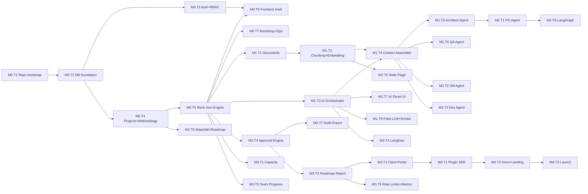

# Krititva AI — Roadmap, Milestones, and Task Breakdown (v1.0)

**Status:** Draft for review
**Upstream:** [krititva-srs.md](krititva-srs.md), [krititva-hld.md](krititva-hld.md), [krititva-lld.md](krititva-lld.md)

This roadmap decomposes v1 into five milestones (M0–M4), each with tasks and subtasks. Every task cites the SRS requirement(s) it delivers and the LLD section(s) it implements. Effort is a rough T-shirt size (S ≤ 2 dev-days, M ≤ 1 week, L ≤ 2 weeks, XL > 2 weeks). Two-lane parallelism is assumed (backend + frontend can proceed together where noted).

Legend: `FR-x.y` → SRS functional requirement, `NFR-x.y` → SRS non-functional requirement, `§LLD n.m` → LLD section anchor.

---

## Milestone Overview

| ID | Name | Duration | Exit criteria |
|---|---|---|---|
| **M0** | Foundation | 4 weeks | Auth + Projects + Work Item Engine + Docker Compose stack running end-to-end for a demo Agile project |
| **M1** | Documents + First Agents | 6 weeks | SRS/HLD/LLD authoring + Architect and QA agents produce draft-and-review outputs with full provenance |
| **M2** | Full Agent Suite + Gates | 6 weeks | PO, Scrum Master, Developer agents complete; multi-sig gates enforced; stale-flag pipeline live |
| **M3** | Agency Layer | 4 weeks | Roadmap-vs-milestone report; capacity view; client portal (both modes); Langfuse dashboards |
| **M4** | Community Launch | 2 weeks | Docs, plugin SDK, demo instance, AGPL release, Show HN, contributions unblocked |

Total v1 estimate: 22 weeks (5.5 months) with two engineers full-time. Parallel-lane opportunities are called out inline.

---

## M0 — Foundation (weeks 1–4)

**Goal:** A logged-in agency team can create clients, projects, and work items on a fully self-hosted stack — no AI features yet.

### M0.T1 — Repo bootstrap and tooling
**Deliverables:** Turborepo skeleton, uv/pnpm workspaces, `apps/api`, `apps/web`, `packages/methodology-templates`, `packages/api-client`, CI pipeline shell.
**Traces:** §LLD 1
**Effort:** S

- **M0.T1.1** Turborepo + pnpm workspace scaffold.
- **M0.T1.2** `apps/api` uv-managed Python 3.12 project, FastAPI + SQLAlchemy 2.0 pinned.
- **M0.T1.3** `apps/web` Next.js 15 App Router + shadcn/ui init.
- **M0.T1.4** GitHub Actions: `ruff`, `mypy --strict`, `pytest`, `eslint`, `tsc`, OpenAPI diff placeholder, license-audit job.
- **M0.T1.5** `docker-compose.yml` structural stack (web, api, worker, postgres+pgvector, redis, litellm — placeholders OK).
- **M0.T1.6** DCO check bot enabled on the repo.

### M0.T2 — Database + migrations foundation
**Deliverables:** Alembic wired, initial migration bringing up `organizations`, `users`, `invitations`, `clients`, `projects`, `project_members`.
**Traces:** FR-4.1.1–4.1.7, FR-4.2.1–4.2.6, FR-4.12.4 · §LLD 2.2 (identity + tenancy blocks)
**Effort:** M

- **M0.T2.1** Alembic init; advisory-lock startup wrapper.
- **M0.T2.2** DDL migration 001: enums (`org_role`, `project_role`, `methodology`, `portal_mode`, `invitation_state`).
- **M0.T2.3** DDL migration 002: `organizations`, `users`, `invitations`, `clients`, `projects`, `project_members`.
- **M0.T2.4** Singleton bootstrap seed for `organizations`.
- **M0.T2.5** SQLAlchemy models + typed session_scope; transactional test fixture (SAVEPOINT-per-test).

### M0.T3 — Auth + RBAC
**Deliverables:** Login, refresh, invitations, `/auth/me`, Argon2id hashing, JWT + refresh rotation, CSRF middleware.
**Traces:** FR-4.1.1–4.1.7, NFR-5.2.1–5.2.3, NFR-5.2.9 · §LLD 3.1 (AuthService), §LLD 4.1
**Effort:** M

- **M0.T3.1** Argon2id password hashing utility + config-tunable params.
- **M0.T3.2** JWT access + refresh with rotation-on-use.
- **M0.T3.3** OIDC pathway via Authlib (behind feature flag; opt-in in v1).
- **M0.T3.4** Invitation issue / accept flow with token-hash storage.
- **M0.T3.5** RBAC decorators: `require_org_role`, `require_project_role`, `require_agent_permission`.
- **M0.T3.6** 404-instead-of-403 policy in service classes (§NFR-5.2.8).
- **M0.T3.7** CSRF double-submit cookie middleware.

### M0.T4 — Projects, clients, methodology config
**Deliverables:** Project CRUD, methodology seed application on create, `workflow_states`, `workflow_transitions`, `hierarchy_rules` editable.
**Traces:** FR-4.2.1–4.2.6, FR-4.3.1–4.3.5 · §LLD 2.2 (methodology config), §LLD 4.2–4.3
**Effort:** M

- **M0.T4.1** Migration 003: `workflow_states`, `workflow_transitions` (with `approval_quorum` JSONB), `hierarchy_rules`.
- **M0.T4.2** `packages/methodology-templates/agile.json`, `waterfall.json`, `hybrid.json` — states, transitions, hierarchy.
- **M0.T4.3** `POST /projects` applies methodology template atomically.
- **M0.T4.4** Config-edit endpoints with in-use safety checks (no removing states with live items).
- **M0.T4.5** Frontend: Project settings page (methodology view, LLM config placeholder).

### M0.T5 — Work Item Engine core
**Deliverables:** `work_items` table + engine implementing hierarchy checks, transitions, cycle-safe link creation, lexorank.
**Traces:** FR-4.4.1–4.4.9 · §LLD 2.2 (work items), §LLD 3.1 (WorkItemService), §LLD 4.4, §LLD 6.4
**Effort:** L

- **M0.T5.1** Migration 004: `work_items`, `work_item_links`, `sprints`, `milestones` (basic), `stale_flags` (empty for now).
- **M0.T5.2** `WorkItemService.create` — hierarchy rule enforcement, per-project `seq` generation.
- **M0.T5.3** `WorkItemService.transition` — state-machine enforcement (gates checked later in M2).
- **M0.T5.4** `WorkItemService.link` — cycle detection on `derived_from` chains.
- **M0.T5.5** Lexorank `rerank` operation with periodic amortized rebalance.
- **M0.T5.6** `bulk_transition` with per-item auth and per-item error reporting.
- **M0.T5.7** Lineage endpoint using SQL function `lineage_chunks` (empty result until docs exist).
- **M0.T5.8** 100% branch coverage on state machine + hierarchy checks (§NFR-5.4.3).

### M0.T6 — Frontend shell
**Deliverables:** Login, dashboard, project list, project home, board (Kanban), backlog list. No documents yet.
**Traces:** UI-1, UI-4 · §LLD 7.1–7.2
**Effort:** L (parallel with T2–T5)

- **M0.T6.1** Route scaffolding (`/`, `/login`, `/setup`, `/(app)/*`).
- **M0.T6.2** Auth flow with TanStack Query + JWT storage in HTTP-only cookies.
- **M0.T6.3** Project dashboard + list.
- **M0.T6.4** Kanban board (dnd-kit) with optimistic transitions.
- **M0.T6.5** Backlog list with rank-based ordering and drag reorder.
- **M0.T6.6** WorkItemDialog with parent picker (hierarchy-aware).

### M0.T7 — Bootstrap + operator experience
**Deliverables:** First-run setup screen, seed org+admin, health probes, backup CLI stub.
**Traces:** FR-4.12.1–4.12.5 · §LLD 8, §HLD 10.1
**Effort:** M

- **M0.T7.1** `/setup` redirect when no `org_admin` exists.
- **M0.T7.2** `/livez` + `/readyz` probes.
- **M0.T7.3** `krititva` CLI skeleton with `backup` and `restore` subcommands (documents `pg_dump -Fc`).
- **M0.T7.4** Docs: `README.md`, self-host quickstart.

**M0 exit checklist:** two engineers can `docker compose up`, complete setup, invite users, create an Agile project, create work items, drag them across a board, and see audit entries.

---

## M1 — Documents + First Agents (weeks 5–10)

**Goal:** SRS/HLD/LLD authoring works, the Architect and QA agents produce draft-and-review artifacts with full provenance, humans accept/reject drafts.

### M1.T1 — Document service + versioning
**Deliverables:** `documents`, `document_versions` immutable append-only, optimistic locking, approve semantics.
**Traces:** FR-4.5.1–4.5.4, FR-4.5.7–4.5.9, FR-4.10.4 · §LLD 2.2 (documents), §LLD 3.1 (DocumentService), §LLD 4.7
**Effort:** L

- **M1.T1.1** Migration 005: `documents`, `document_versions` with `content_hash`.
- **M1.T1.2** `DocumentService.create_version` with optimistic lock on `base_version_id`.
- **M1.T1.3** `approve` enforcing single-approved invariant (partial unique index).
- **M1.T1.4** PDF export via headless renderer (Mermaid pre-rendered to SVG).
- **M1.T1.5** Frontend DocumentEditor (TipTap) with Markdown, Mermaid preview, version-history panel.

### M1.T2 — Chunking + embedding pipeline
**Deliverables:** Section-aware chunker, embedding worker, discriminated `embedding` + `embedding_model` (+ optional `embedding_alt`).
**Traces:** FR-4.5.4–4.5.6, NFR-5.1.3, NFR-5.1.5 · §LLD 2.2 (document_chunks), §HLD 5.4
**Effort:** M

- **M1.T2.1** Migration 006: `document_chunks` with dual-column embeddings and HNSW indexes.
- **M1.T2.2** Chunker: split on H1–H4, tag `section_path`, compute `content_hash` and `token_count`.
- **M1.T2.3** Embedding worker (arq): consumes chunk batches, calls Ollama `/api/embeddings`, writes back.
- **M1.T2.4** Retrieval query helper filtered by (project, approved current, embedding_model).
- **M1.T2.5** Load test: 10k-chunk corpus, top-20 retrieval < 150 ms p95 (§NFR-5.1.3).

### M1.T3 — AI Orchestrator + SSE
**Deliverables:** `ai_generation_jobs`, `ai_provenance`, enqueue endpoint, SSE stream, heartbeat sweeper, per-user semaphore.
**Traces:** FR-4.6.2–4.6.10, NFR-5.2.5, NFR-5.3.1–5.3.2 · §LLD 2.2, §LLD 3.1, §LLD 5.7, §LLD 10
**Effort:** L

- **M1.T3.1** Migration 007: `ai_generation_jobs`, `ai_provenance`.
- **M1.T3.2** `AIOrchestrator.enqueue` with all authorization checks.
- **M1.T3.3** Redis semaphore for per-user AI job concurrency (default 3).
- **M1.T3.4** SSE endpoint bridging Redis pub/sub with 15 s heartbeat and initial-state replay.
- **M1.T3.5** `worker_heartbeat_sweeper` cron; failed-terminal-frame publisher.
- **M1.T3.6** `accept` / `reject` endpoints with audit logging.

### M1.T4 — Context Assembler
**Deliverables:** Lineage-first + semantic + operational assembly with token-budget packing and provenance-before-call persistence.
**Traces:** FR-4.6.9, FR-4.10.2, NFR-5.4.3 · §LLD 5.2–5.3
**Effort:** L

- **M1.T4.1** `lineage_chunks(_focus, _max_depth)` SQL function.
- **M1.T4.2** `ContextAssembler.assemble` with three-stage packing.
- **M1.T4.3** `persist_provenance` per stage.
- **M1.T4.4** Token counter (tiktoken-compat for chosen models).
- **M1.T4.5** Overflow fallback: `summarize_lineage_fallback` (small model summarization of oldest lineage nodes).
- **M1.T4.6** 90%+ line coverage; property-based tests on packing invariants (Hypothesis).

### M1.T5 — Architect agent (HLD, LLD)
**Deliverables:** Architect profile, `DesignDocument` schema, section-by-section generation for LLD, Mermaid preserved.
**Traces:** FR-4.6.1, FR-4.6.5–4.6.7 · §LLD 5.1, §LLD 5.4, §LLD 5.5
**Effort:** L

- **M1.T5.1** `app/ai/profiles/architect.py` implementing `RoleProfile`.
- **M1.T5.2** Jinja templates for `render_system` and `render_user`.
- **M1.T5.3** `persist_draft` writes a `document_versions` row (`doc_type='hld'|'lld'`, `status='draft'`).
- **M1.T5.4** Section-by-section generation loop with per-section citation validation.
- **M1.T5.5** `DesignDocument` Pydantic schema + tests.

### M1.T6 — QA agent (Test Cases)
**Deliverables:** QA profile, `TestCaseSet` schema, generates test cases as **work_items** (`kind='test_case'`) linked via `tests` to stories.
**Traces:** FR-4.6.1, FR-4.6.5, FR-4.6.7 · §LLD 5.1, §LLD 5.4, §LLD 5.5
**Effort:** M

- **M1.T6.1** `qa.py` profile.
- **M1.T6.2** `persist_draft` writes work_items with `ai_generated=TRUE`, `state='draft'` (fresh Agile state); links via `work_item_links(link_type='tests')`.
- **M1.T6.3** `TestCase.srs_citations` validated non-empty.

### M1.T7 — AI Panel UI + provenance viewer
**Deliverables:** Frontend surface for job list, live progress, provenance list with clickable citations, accept/reject.
**Traces:** UI-5, FR-4.6.8, FR-4.10.2 · §LLD 7.2 (AIPanel), §LLD 4.8
**Effort:** M (parallel with T3–T6)

- **M1.T7.1** SSE client hook (auto-reconnect, poll fallback).
- **M1.T7.2** Provenance list rendering `[SRS §x.y.z]` as deep-link chips.
- **M1.T7.3** Accept/reject actions with confirmation on stale-flag interaction.
- **M1.T7.4** Draft diff view (side-by-side vs current approved).

### M1.T8 — Fake LLM + smoke suite
**Deliverables:** `FakeLLMClient` for deterministic CI; opt-in Ollama-backed smoke run on tagged releases.
**Traces:** NFR-5.4.3 · §LLD 9.2
**Effort:** S

- **M1.T8.1** `FakeLLMClient` with fixture responses per profile.
- **M1.T8.2** Contract tests for every profile's output schema.
- **M1.T8.3** Real-Ollama smoke suite runner (skipped by default).

**M1 exit checklist:** author an SRS document in-app; approve it; invoke the Architect agent for an LLD focused on an epic; see live SSE progress; review the draft with provenance citations; accept; the draft becomes an `approved` version.

---

## M2 — Full Agent Suite + Gates (weeks 11–16)

**Goal:** All five agents complete; multi-signature gates enforced; SRS supersession triggers stale flags; Waterfall template usable end-to-end.

### M2.T1 — Project Owner agent (SRS + Epic breakdown)
**Deliverables:** PO profile with `SRSDocument` and `EpicBreakdown` schemas; LangGraph epic-decomposition workflow.
**Traces:** FR-4.6.1, FR-4.6.11 · §LLD 5.1, §LLD 5.4, §HLD 6.4
**Effort:** L

- **M2.T1.1** `project_owner.py` profile.
- **M2.T1.2** `EpicBreakdown` schema; per-epic `derived_from` link generation.
- **M2.T1.3** LangGraph `epic_decompose`: `plan_stories → generate_each_story → validate_acceptance → capacity_check → human_review`.
- **M2.T1.4** LangGraph checkpoints persisted to Postgres (worker-crash recoverable).

### M2.T2 — Scrum Master agent
**Deliverables:** SM profile with `SprintPlan` and `StoryBreakdown` schemas; capacity signal integration.
**Traces:** FR-4.6.1, FR-4.8.4 · §LLD 5.1, §LLD 5.4
**Effort:** M

- **M2.T2.1** `scrum_master.py` profile.
- **M2.T2.2** Retrieval policy including sprint dates + capacity JSON.
- **M2.T2.3** Bottleneck flag emission in `SprintPlan` outputs.

### M2.T3 — Developer agent
**Deliverables:** Dev profile with `TaskBreakdown` and `APIContract` (OpenAPI-fragment) schemas.
**Traces:** FR-4.6.1 · §LLD 5.1, §LLD 5.4
**Effort:** M

- **M2.T3.1** `developer.py` profile.
- **M2.T3.2** `APIContract` schema (OpenAPI-3.1 subset via Pydantic).
- **M2.T3.3** `persist_draft` writes task work_items with `estimated_hours` populated when the model provides it.

### M2.T4 — Approval Engine + gate enforcement
**Deliverables:** `milestone_approvals` table + service + endpoints; `WorkItemService.transition` enforces gates.
**Traces:** FR-4.7.1–4.7.7 · §LLD 2.2, §LLD 3.1, §LLD 4.6, §HLD 5.3
**Effort:** L

- **M2.T4.1** Migration 008: `milestone_approvals`; remove `approved_by`/`approved_at` from `milestones` (drop with data-preserving copy into `milestone_approvals`).
- **M2.T4.2** `ApprovalService.record` with quorum evaluation reading `workflow_transitions.approval_quorum`.
- **M2.T4.3** Rejection reason required; revocation semantics.
- **M2.T4.4** `WorkItemService.transition` checks `is_hard_gate` and denies with `GateNotApproved` when quorum unmet.
- **M2.T4.5** ApprovalBar UI component (quorum tracker with per-role signature slots).

### M2.T5 — Waterfall template + roadmap view
**Deliverables:** Waterfall seed produces phase→deliverable→task hierarchy with `gate_review` states; Gantt-like roadmap view.
**Traces:** FR-4.3.4, FR-4.3.5 · §LLD 4.3, §LLD 7.2 (RoadmapView)
**Effort:** M

- **M2.T5.1** `waterfall.json` template.
- **M2.T5.2** `hybrid.json` template.
- **M2.T5.3** Roadmap view rendering phases + gates + milestones on a timeline (OSS Gantt lib e.g. `frappe-gantt`).
- **M2.T5.4** Roadmap PDF export.

### M2.T6 — SRS supersession + stale flags
**Deliverables:** Diff worker; `stale_flags` table populated; UI banner on stale artifacts.
**Traces:** FR-4.6.10 · §LLD 2.2, §HLD 5.5
**Effort:** M

- **M2.T6.1** Migration 009: ensure `stale_flags` shipped in M0 has all columns; add resolved-tracking fields if not.
- **M2.T6.2** `srs_supersession_diff` worker: diff by `content_hash` per `section_path`; walk provenance; insert `stale_flags`.
- **M2.T6.3** UI banner on documents/work_items with open stale flags; "re-invoke agent" one-click.
- **M2.T6.4** Resolve endpoint (mark flag resolved on acceptance of a fresh draft that supersedes).

### M2.T7 — Audit export
**Deliverables:** JSONL export endpoint; every AI + gate + doc event covered.
**Traces:** FR-4.10.1, FR-4.10.3 · §LLD 4.10, §HLD 7.3
**Effort:** S

- **M2.T7.1** `GET /projects/{id}/audit-log/export.jsonl` (streaming).
- **M2.T7.2** Every service verified to write audit entries via a decorator test.

### M2.T8 — LangGraph regeneration workflow (evaluation)
**Deliverables:** LangGraph graphs shipped only for epic decomposition and SRS ingestion; supersession stays in deterministic worker.
**Traces:** FR-4.6.11 · §HLD 6.4, §LLD 5
**Effort:** M

- **M2.T8.1** `graphs/srs_ingest.py` (parse → extract → conflict-detect → propose mapping).
- **M2.T8.2** Documentation + tests for graph checkpointing and resume.

**M2 exit checklist:** create a Waterfall project; author SRS; approve SRS; generate HLD, LLD, epics, stories, tasks, test cases; drive an epic to `gate_review`; two approvers sign off; transition succeeds; supersede the SRS; downstream artifacts flip to stale.

---

## M3 — Agency Layer (weeks 17–20)

**Goal:** Client-facing surfaces and reporting land; the "agency wedge" story is real.

### M3.T1 — Sprints + capacity view
**Deliverables:** `capacity_entries`, sprint capacity view, overallocation flags.
**Traces:** FR-4.8.1–4.8.5 · §LLD 2.2, §LLD 4.5
**Effort:** M

- **M3.T1.1** Migration 010: `capacity_entries` (if not shipped in M0).
- **M3.T1.2** Capacity aggregation query and materialized-view option.
- **M3.T1.3** Overallocation flag propagation to Scrum Master agent context.

### M3.T2 — Roadmap-vs-milestone report
**Deliverables:** The core client-shareable report.
**Traces:** FR-4.9.1, FR-4.9.2 · §LLD 3.1, §LLD 4.9
**Effort:** M

- **M3.T2.1** `ReportsService.roadmap_vs_milestone` query.
- **M3.T2.2** In-app view + PDF export.
- **M3.T2.3** Rejection reasons prominently displayed (dispute record).

### M3.T3 — Client portal (both modes)
**Deliverables:** `client_portal_mode` handling: `export_only` signed links + `portal` client-user login and gated views.
**Traces:** FR-4.2.5, FR-4.11.1–4.11.4 · §LLD 2.2, §LLD 4.9, §HLD 7.2 (RoadmapView)
**Effort:** L

- **M3.T3.1** Migration 011: `signed_links`.
- **M3.T3.2** `signed_links` service: create/revoke/verify.
- **M3.T3.3** `/public/signed/{token}` route emitting portal HTML or PDF.
- **M3.T3.4** `client_approver` role wiring; portal login flow; RBAC serializer with `for_audience='client'`.
- **M3.T3.5** Audit rows on every portal fetch.

### M3.T4 — Langfuse integration + dashboards
**Deliverables:** Langfuse compose profile; trace correlation on every AI job; ops dashboards.
**Traces:** SI-4, FR-4.10.2 · §HLD 3.1, §HLD 7.4
**Effort:** S

- **M3.T4.1** Langfuse service in compose (opt-in profile `obs`).
- **M3.T4.2** Trace id on every LiteLLM call; env-configurable.
- **M3.T4.3** Reference dashboards JSON committed to `deploy/langfuse/`.

### M3.T5 — Team progress view
**Deliverables:** Cross-project team view for the agency (internal only by default).
**Traces:** FR-4.9.3 · §LLD 4.9
**Effort:** S

- **M3.T5.1** State + sprint summary widget.
- **M3.T5.2** Toggle to expose to client (off by default).

### M3.T6 — Rate limits, prometheus metrics, hardening
**Deliverables:** Prometheus `/metrics`; per-org RPS limit; per-user AI concurrency polished; production readiness pass.
**Traces:** NFR-5.2.5, NFR-5.1.1–5.1.5, §HLD 7.4–7.5
**Effort:** M

- **M3.T6.1** `prometheus_client` histograms on request latency, queue depth, job durations.
- **M3.T6.2** Rate limiter with Redis token bucket (org-scope).
- **M3.T6.3** Performance test suite hitting the NFR-5.1 numbers.
- **M3.T6.4** Security review pass against threats (§HLD 12).

**M3 exit checklist:** an external client user logs in (portal mode), sees the roadmap report, co-signs a gate, and every one of their actions is in the audit log.

---

## M4 — Community Launch (weeks 21–22)

**Goal:** Ready for public release under AGPL with a plugin story.

### M4.T1 — Agent plugin SDK
**Deliverables:** Entry-point contract, minimal example package, plugin author guide.
**Traces:** FR-4.6.11, NFR-5.4.5 · §HLD 6.1, §LLD 5.1
**Effort:** M

- **M4.T1.1** Formalize `krititva.agents` entry-point group.
- **M4.T1.2** Example plugin package (`krititva-agent-example`) with an "analyst" agent.
- **M4.T1.3** Plugin author guide (`docs/plugins.md`).

### M4.T2 — Public docs + landing
**Deliverables:** README, CONTRIBUTING, self-host operator guide, plugin guide, deploy recipes.
**Traces:** OR-6.2 · §HLD 3
**Effort:** M

- **M4.T2.1** README with 60-second demo.
- **M4.T2.2** CONTRIBUTING with DCO instructions.
- **M4.T2.3** Operator guide (backup, upgrade, migrate).
- **M4.T2.4** Screencast + hosted-demo instance (`demo.krititva.dev`).

### M4.T3 — Launch checklist
**Deliverables:** SBOM, license audit, security disclosure policy.
**Traces:** NFR-5.6.1, NFR-5.6.4 · §HLD 12
**Effort:** S

- **M4.T3.1** `cyclonedx` SBOM emitted in CI.
- **M4.T3.2** `SECURITY.md` with vuln disclosure email.
- **M4.T3.3** AGPL LICENSE file committed and reviewed.
- **M4.T3.4** Show HN + relevant subreddits + LinkedIn post staged.

---

## Dependency Graph (high-level)

---

## Coverage Check — SRS → Milestone

| SRS Requirement | Milestone.Task |
|---|---|
| FR-4.1.* Identity & RBAC | M0.T2, M0.T3 |
| FR-4.2.* Projects/Clients | M0.T2, M0.T4 |
| FR-4.3.* Methodology | M0.T4, M2.T5 |
| FR-4.4.* Work Item Engine | M0.T5 |
| FR-4.5.* Documents | M1.T1, M1.T2 |
| FR-4.6.1–4.6.7 Agents core | M1.T3, M1.T5, M1.T6, M2.T1, M2.T2, M2.T3 |
| FR-4.6.8 SSE | M1.T3 |
| FR-4.6.9 Context assembly | M1.T4 |
| FR-4.6.10 Stale flags | M2.T6 |
| FR-4.6.11 Plugin surface | M4.T1 |
| FR-4.6.12 Kill-switches | M0.T4 (config) + M1.T3 (enforcement) |
| FR-4.7.* Approvals | M2.T4 |
| FR-4.8.* Sprints & capacity | M0.T5 (sprints), M3.T1 |
| FR-4.9.* Reporting | M3.T2, M3.T5 |
| FR-4.10.* Audit & Provenance | M0.T3–T5 (audit-sink pattern), M1.T3, M2.T7 |
| FR-4.11.* Client Portal | M3.T3 |
| FR-4.12.* Self-host Ops | M0.T7, M4.T2 |
| NFR-5.1.* Performance | M1.T2, M3.T6 |
| NFR-5.2.* Security | M0.T3, M3.T6 |
| NFR-5.3.* Reliability | M1.T3 |
| NFR-5.4.* Maintainability | M0.T1 (CI), M1.T4/T8 (coverage) |
| NFR-5.5.* Portability | M0.T7, M4.T2 |
| NFR-5.6.* Compliance | M4.T3 |
| OR-6.1 i18n | M0.T6 (framework only), deferred v1.5 for translations |
| OR-6.2 Documentation | M4.T2 |
| OR-6.3 Traceability CI | M0.T1 (job placeholder), M2.T7 (JSONL) |

Every requirement in the SRS resolves to at least one task. Any additional coverage gaps discovered during phase planning become new tasks appended to the owning milestone.

---

## Risks Tracked Against the Roadmap

- **Small local model quality** (§HLD 12) — M1.T5 section-by-section generation and M1.T4 fallback address this; if it still underperforms, M2.T8 slack absorbs a "hosted-model recommendation" adjustment.
- **Embedding model swap** — M1.T2 discriminated columns; M3.T6 backfill script if a customer swaps mid-flight.
- **Prompt injection** — M1.T5 schema-strict output enforcement; M3.T6 security-review pass exercises it.
- **SSE proxy buffering** — M1.T3 reference nginx config with `X-Accel-Buffering: no`.
- **LangGraph over-engineering** — M2.T8 limits LangGraph to two workflows; supersession stays deterministic.

---

## Post-v1 (out of scope for this roadmap, referenced for context)

- **v1.5**: Full capacity planning (velocity, historicals), critical-path math, per-model embedding backfill UI, real Gantt auto-scheduling suggestion (not scheduling).
- **v2**: GitHub/GitLab/Slack integrations via webhooks; CRDT collaborative editing; opt-in autonomous AI actions gated by policy engine.
- **v2+**: Native mobile apps; billing integrations via API; time tracking.
